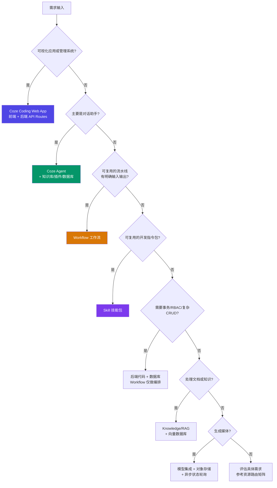

# Agent Routing Rules

路由决策树 / Routing decision tree. Use this file to decide where each function belongs.

## Decision flowchart

## Decision tree (text version)

1. **Is the deliverable a visual app or admin system?**
   - Yes -> Coze Coding web app / frontend + backend routes.
   - No -> continue.
2. **Is it mainly a conversational assistant?**
   - Yes -> ordinary Coze Agent, plus knowledge/plugins/database as needed.
3. **Is it a repeatable pipeline with clear inputs and outputs?**
   - Yes -> Workflow.
4. **Is it a reusable developer instruction package?**
   - Yes -> Skill.
5. **Does it need transactions, RBAC, or complex CRUD?**
   - Use backend code + database, with workflow only as orchestration.
6. **Does it process documents or knowledge?**
   - Use Knowledge/RAG or vector DB; preserve metadata.
7. **Does it generate media?**
   - Use model integration + storage + async state.

## Backend code vs workflow

Use backend code when:

- Multiple tables must be updated atomically.
- Permissions and row-level rules matter.
- Inputs need strict validation.
- Business logic needs tests.
- The workflow graph would be hard to maintain.

Use workflow when:

- A non-developer should inspect/adjust the steps.
- Steps call independent tools/APIs.
- Inputs and outputs are stable.
- The process is reusable across apps/agents.

## Agent vs web app

Use an Agent when the user experience is conversational. Use a web app when the user needs dashboards, CRUD tables, file management, charting, role-based pages, or complex UI state.

## Knowledge/RAG vs database

Use database for structured business state. Use RAG for source-grounded text/document retrieval. Use both when documents have metadata and business lifecycle state.

## Single HTML routing

- Deployed full-stack URL -> iframe wrapper.
- Static/Vite client-only build -> inspect, then single-file bundle.
- Course text/images -> editorial template.
- Need both context and app -> split or cover-launch wrapper.
- Need offline parity with backend -> explain impossibility; offer static demo or network-dependent wrapper.
